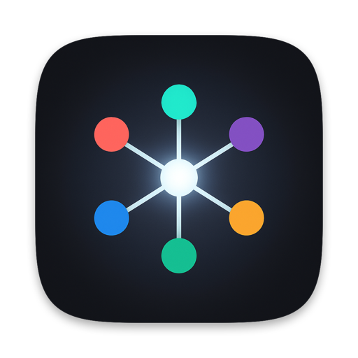

<p align="center">
  
</p>

<h1 align="center">N2 Agents</h1>

<p align="center">
  <strong>One identity, every lab.</strong><br>
  Work · personal · client — each profile holds its own Claude, Codex, Grok,
  Cursor, opencode and Muse login, switched together or pinned one at a time.<br>
  A menu bar app plus a small CLI.
</p>

<p align="center">
  <a href="https://github.com/noisyneighborstudio/n2-agents/releases/latest"></a>
  
  <a href="#license"></a>
</p>

<p align="center">
  <a href="#install"><b>Install</b></a> ·
  <a href="#the-model">The model</a> ·
  <a href="#everyday-use">Everyday use</a> ·
  <a href="#supported-labs">Supported labs</a> ·
  <a href="#the-agents-cli">CLI</a> ·
  <a href="#coming-from-claudes">Coming from Claudes</a> ·
  <a href="#troubleshooting">Troubleshooting</a>
</p>

<br>

N2 Agents is a fork of [`claudes`](https://github.com/noisyneighborstudio/claudes),
generalised from one lab to all of them. `claudes` is still maintained and the two
run side by side — see [Coming from Claudes](#coming-from-claudes).

## Install

```sh
curl -fsSL https://raw.githubusercontent.com/noisyneighborstudio/n2-agents/main/install.sh | zsh
```

<details>
<summary>Prefer to read before you pipe?</summary>

```sh
git clone https://github.com/noisyneighborstudio/n2-agents && cd n2-agents
./install.sh
```

</details>

The installer prefers the signed release and falls back to building from source
(prompting for Xcode Command Line Tools if missing). It puts `agents` and the
per-profile commands on your `PATH`, and adds tab completion for **zsh**,
**bash**, and **fish** — whichever you have.

Then:

1. Menu bar → **N2 Agents icon** → **New Profile…** → e.g. `Work`
2. Sign in once per lab in that profile
3. Optional — add `N2 Agents` to **System Settings → Login Items**

## The model

A profile is an **identity**, not a login. `Work` holds one slot per lab:

```
~/.n2-agents/
  Work/
    claude/        -> CLAUDE_CONFIG_DIR
    codex/         -> CODEX_HOME
    grok/          -> GROK_HOME
  Personal/
    claude/
    codex/
```

So `agents use Work` moves Claude, Codex and Grok in one step, instead of
switching each tool by hand and hoping you got them all.

Underneath, every lab reads a config-dir environment variable, so a profile is
pinned **per process**. Two profiles run side by side, and a running session
keeps its profile no matter what you switch to later. `agents vendors` prints
the live table.

## Everyday use

```sh
agents list                     # profiles × labs, and which is active
agents use Work                 # switch every lab at once
agents use Work --vendor codex  # …or just one

claude-work                     # run Claude Code as Work
codex-work                      # run Codex as Work
grok-personal                   # run Grok as Personal

agents run Work --vendor codex  # the long form of the same thing
agents run --best               # whichever profile has the most quota left
```

The `<vendor>-<profile>` commands are real executables on `PATH`, not shell
functions, so editors, GUI apps and scripts get them too.

## Supported labs

| Lab | CLI | Config home | Isolation | Desktop app | Usage API | Sessions |
|---|---|---|---|---|---|---|
| Claude | `claude` | `~/.claude` | `CLAUDE_CONFIG_DIR` | cloned per profile | ✅ | ✅ |
| Codex | `codex` | `~/.codex` | `CODEX_HOME` | `codex app` | ✅ | ✅ |
| Grok | `grok` | `~/.grok` | `GROK_HOME` | — | ✅ (weekly) | — |
| Cursor | `cursor-agent` | `~/.cursor` | `CURSOR_CONFIG_DIR` | — | — | — |
| opencode | `opencode` | `~/.config/opencode` | `XDG_CONFIG_HOME` | — | — | — |
| Muse (Meta) | `muse` | `~/.config/muse` | `XDG_CONFIG_HOME` + file credentials | — | ✅ (on demand) | — |

Every one of those isolation levers was verified against the shipped binary
rather than taken from documentation.

Gemini is no longer supported. Gemini CLI stopped serving personal accounts on
June 18, 2026, and its successor, Antigravity CLI (`agy`), keeps its login in
the macOS Keychain, where no profile switch can reach it. On first launch after
the update, a `~/.gemini` that N2 Agents had linked into a profile turns back
into a plain directory with the same contents.

Claude, Codex, Grok and Muse expose a server-side quota endpoint, so `agents best`
works for those four and tells you plainly that the others have nothing to rank.
Grok has one weekly credit pool and no 5-hour window. Each Muse read mints an
inference key, so the menu bar app reads Muse only when you open the panel or
press retry, never on its timer. Muse reports numbers only while a 5-hour
window is open; between windows its row says "no reading".

Muse keeps its sign-in in one keychain item whatever `XDG_CONFIG_HOME` says, so
every profile but Default runs it with `TBH_CREDENTIAL_BACKEND=file` and keeps
its login in its own slot. Default keeps the keychain login a plain `muse` uses.
A profile set up before this has to sign in to Muse once more.

**Adding a lab** means adding one `case` arm to each accessor in
[`vendors.sh`](vendors.sh). Nothing in `agents` or the menu bar app needs to
change.

## The `agents` CLI

```
agents list                           profiles × vendors
agents vendors                        labs found here, and how each isolates
agents active [--vendor <v>]          active profile ("mixed" if labs disagree)
agents use <Profile> [--vendor <v>]   switch
agents run <Profile|--next|--best> [--vendor <v>] [--start-from-session=<id>]
agents best [--vendor <v>]            per-profile usage (5h/7d windows)
agents new <Name> [--vendors a,b] [--cli-only]
agents delete <Name> [--everything] [--yes]
agents adopt [--yes]                  import existing `claudes` profiles
agents sessions [Profile] [--vendor <v>]
agents transfer <id> --to <Profile>|--next|--best [--vendor <v>]
agents desktop [Name|--next|--best] [--vendor <v>]
agents shims [--remove]               sync <vendor>-<profile> commands on PATH
agents repatch [Name]                 rebuild Claude clones after an update
```

The CLI is the single authoritative implementation. The menu bar app parses
`agents porcelain` and shells back out for anything with side effects, so the
two cannot drift.

## Sessions & rotation

Claude and Codex transcripts can be listed and moved between profiles:

```sh
agents sessions Work --vendor codex
agents transfer <id> --to Personal --vendor codex
agents run Personal --vendor codex --start-from-session=<id>
```

`--best` picks the profile with the most quota left (from the same endpoint
the lab's own CLI reads for its usage screen — real server-side numbers, not a
local guess). `--next` round-robins.

## Coming from Claudes

Both apps can be installed at once. They use different roots
(`~/.claude-profiles` vs `~/.n2-agents`), different PATH commands (`claudes` vs
`agents`) and different bundle ids.

```sh
agents adopt
```

Each `claudes` profile becomes `~/.n2-agents/<Name>/claude` as a **symlink** to
the existing directory — shared, not copied. Both tools then read and write one
login. A copy would force a re-login, because Claude Code keys its keychain
entry to the config dir's path, and would leave two diverging copies of the same
account.

Add other labs to an adopted profile with:

```sh
agents new ExpoIO --vendors codex,grok
```

## The menu bar app

- Every profile, with its labs listed and the active one ticked
- Open any lab in your terminal of choice (Terminal, iTerm2, Warp, Ghostty, kitty, Alacritty, WezTerm)
- **Add Vendor…** to give an existing profile another lab
- Claude Desktop clones, auto-repatched when Claude updates
- Claude session transfer between profiles
- Sparkle self-updates on a stable or continuous channel

## Troubleshooting

**`agents: unknown vendor 'x'`** — run `agents vendors` for the known ids.

**A lab shows `-` for every profile** — its CLI isn't on `PATH`. `agents vendors`
prints the install command.

**`agents active` says `mixed`** — your labs are on different profiles, which is
allowed. `agents list` shows which is where; `agents use <Profile>` realigns them.

**A shim is missing** — `agents shims`. Shims exist only for
(lab, profile) pairs that actually have a slot.

## Development

```sh
./scripts/test.sh      # syntax, adapter table, profile lifecycle, shims, release plumbing
./tray/build.sh        # builds "tray/build/N2 Agents.app"
```

The app is `N2 Agents.app`, with the same bundle and executable name, so
Finder, Activity Monitor and Login Items all agree. Installs made before the
rename live at `N2Agents.app`; Sparkle updates keep that path, and `install.sh`
moves them (and re-points the PATH links) to the new name.

## License

MIT — see [LICENSE](LICENSE).
