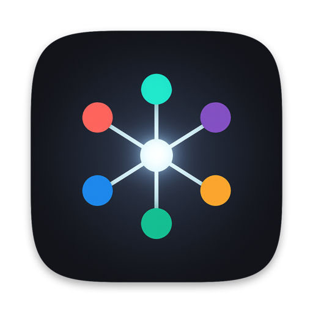

<p align="center">
  
</p>

<h1 align="center">N2 Agents</h1>

<p align="center">
  <strong>One identity, every lab.</strong><br>
  Work · personal · client — each profile holds its own Claude, Codex, Grok,
  Cursor, opencode and Muse login, switched together or pinned one at a time.<br>
  A menu bar app plus a small CLI.
</p>

<p align="center">
  <a href="https://github.com/noisyneighborstudio/n2-agents/releases/latest"></a>
  
  <a href="#license"></a>
</p>

<p align="center">
  <a href="#install"><b>Install</b></a> ·
  <a href="#the-model">The model</a> ·
  <a href="#everyday-use">Everyday use</a> ·
  <a href="#supported-labs">Supported labs</a> ·
  <a href="#the-agents-cli">CLI</a> ·
  <a href="#coming-from-claudes">Coming from Claudes</a> ·
  <a href="#troubleshooting">Troubleshooting</a>
</p>

<br>

N2 Agents is a fork of [`claudes`](https://github.com/noisyneighborstudio/claudes),
generalised from one lab to all of them. `claudes` is still maintained and the two
run side by side — see [Coming from Claudes](#coming-from-claudes).

## Install

```sh
curl -fsSL https://raw.githubusercontent.com/noisyneighborstudio/n2-agents/main/install.sh | zsh
```

<details>
<summary>Prefer to read before you pipe?</summary>

```sh
git clone https://github.com/noisyneighborstudio/n2-agents && cd n2-agents
./install.sh
```

</details>

The installer prefers the signed release and falls back to building from source
(prompting for Xcode Command Line Tools if missing). It puts `agents` and the
per-profile commands on your `PATH`, and adds tab completion for **zsh**,
**bash**, and **fish** — whichever you have.

Then:

1. Menu bar → **N2 Agents icon** → **New Profile…** → e.g. `Work`
2. Sign in once per lab in that profile
3. Optional — add `N2 Agents` to **System Settings → Login Items**

## The model

A profile is an **identity**, not a login. `Work` holds one slot per lab:

```
~/.n2-agents/
  Work/
    claude/        -> CLAUDE_CONFIG_DIR
    codex/         -> CODEX_HOME
    grok/          -> GROK_HOME
  Personal/
    claude/
    codex/
```

So `agents use Work` moves Claude, Codex and Grok in one step, instead of
switching each tool by hand and hoping you got them all.

Underneath, every lab reads a config-dir environment variable, so a profile is
pinned **per process**. Two profiles run side by side, and a running session
keeps its profile no matter what you switch to later. `agents vendors` prints
the live table.

## Everyday use

```sh
agents list                     # profiles × labs, and which is active
agents use Work                 # switch every lab at once
agents use Work --vendor codex  # …or just one

claude-work                     # run Claude Code as Work
codex-work                      # run Codex as Work
grok-personal                   # run Grok as Personal

agents run Work --vendor codex  # the long form of the same thing
agents run --best               # whichever profile has the most quota left
```

The `<vendor>-<profile>` commands are real executables on `PATH`, not shell
functions, so editors, GUI apps and scripts get them too.

## Supported labs

| Lab | CLI | Config home | Isolation | Desktop app | Usage API | Sessions |
|---|---|---|---|---|---|---|
| Claude | `claude` | `~/.claude` | `CLAUDE_CONFIG_DIR` | an instance per profile | ✅ | ✅ |
| Codex | `codex` | `~/.codex` | `CODEX_HOME` | an instance per profile | ✅ | ✅ |
| Grok | `grok` | `~/.grok` | `GROK_HOME` | — | ✅ (weekly) | — |
| Cursor | `cursor-agent` | `~/.cursor` | `CURSOR_CONFIG_DIR` (settings only) | — | ✅ (monthly, one login) | — |
| opencode | `opencode` | `~/.config/opencode` | `XDG_CONFIG_HOME` | — | — | — |
| Muse (Meta) | `muse` | `~/.config/muse` | `XDG_CONFIG_HOME` + file credentials | — | ✅ (on demand) | — |

Every one of those isolation levers was verified against the shipped binary
rather than taken from documentation.

Grok's installer puts the CLI itself inside `~/.grok` (`bin/`, `downloads/`).
Each profile's Grok slot links those to Default's, so `grok` stays on `PATH`
whichever profile is active.

Gemini is no longer supported. Gemini CLI stopped serving personal accounts on
June 18, 2026, and its successor, Antigravity CLI (`agy`), keeps its login in
the macOS Keychain, where no profile switch can reach it. On first launch after
the update, a `~/.gemini` that N2 Agents had linked into a profile turns back
into a plain directory with the same contents.

Claude Desktop and Codex open per profile as extra instances of the app you
already have, each with the profile's own data dir and config dir, so every
profile stays signed in to its own account side by side. The app itself is
never copied or modified: passkeys, computer use, notifications and updates
work as they do in the stock app, and there is nothing to rebuild when it
updates. Default is the app as you normally open it. The catch is identity:
every instance has the stock app's name and Dock icon, and `claude://` or
`codex://` links go to whichever instance macOS picks.

Claude, Codex, Grok, Muse and Cursor expose a server-side quota endpoint, so
`agents best` works for those five and tells you plainly that the others have
nothing to rank.
Grok has one weekly credit pool and no 5-hour window. Each Muse read mints an
inference key, so the menu bar app reads Muse only when you open the panel or
press retry, never on its timer. Muse reports numbers only while a 5-hour
window is open; between windows its row says "idle".

Muse keeps its sign-in in one keychain item whatever `XDG_CONFIG_HOME` says, so
every profile but Default runs it with `TBH_CREDENTIAL_BACKEND=file` and keeps
its login in its own slot. Default keeps the keychain login a plain `muse` uses.
A profile set up before this has to sign in to Muse once more.

Cursor has no such switch: `cursor-agent` keeps one keychain login for the
machine, and `CURSOR_CONFIG_DIR` moves only its settings. Every profile's
Cursor is the same account, so its usage (a monthly billing cycle, tagged "mo")
shows once, on Default; other profiles' Cursor rows say "shared login" and
share Default's room in rotation.

To check every account from scratch, open **Settings → Accounts → Sign Out of
All Accounts and Set Up Again**. The app signs out the listed accounts,
including Default, then the original setup window opens for each profile.
Login prompts stay inside the app; browser authorization opens when needed.
Use Continue when a profile is ready to set up the next one. Unfinished
profiles show Finish setup in the panel. Profiles, configuration and session history are kept. Close running
agent sessions first and choose the intended browser account at each login.
Cursor's shared account is set up once. You can also run `agents reonboard`.

**Adding a lab** means adding one `case` arm to each accessor in
[`vendors.sh`](vendors.sh). Nothing in `agents` or the menu bar app needs to
change.

## The `agents` CLI

```
agents list                           profiles × vendors
agents vendors                        labs found here, and how each isolates
agents active [--vendor <v>]          active profile ("mixed" if labs disagree)
agents use <Profile> [--vendor <v>]   switch
agents run <Profile|--next|--best> [--vendor <v>] [--start-from-session=<id>]
agents best [--vendor <v>]            per-profile usage (5h/7d windows)
agents new <Name> [--vendors a,b]
agents delete <Name> [--yes]
agents adopt [--yes]                  import existing `claudes` profiles
agents sessions [Profile] [--vendor <v>]
agents transfer <id> --to <Profile>|--next|--best [--vendor <v>]
agents desktop [Name|--next|--best] [--vendor <v>]
agents shims [--remove]               sync <vendor>-<profile> commands on PATH
agents loop "goal" [--budget 2h]      pursue a whole goal across every slot
agents busybar on|off|status          lab alerts on a BUSY Bar (docs/busy-bar.md)
```

The CLI is the single authoritative implementation. The menu bar app parses
`agents porcelain` and shells back out for anything with side effects, so the
two cannot drift.

## Sessions & rotation

Claude and Codex transcripts can be listed and moved between profiles:

```sh
agents sessions Work --vendor codex
agents transfer <id> --to Personal --vendor codex
agents run Personal --vendor codex --start-from-session=<id>
```

`--best` picks the profile with the most quota left (from the same endpoint
the lab's own CLI reads for its usage screen — real server-side numbers, not a
local guess). `--next` round-robins.

## Loops

For a goal bigger than one session, `agents loop` fans it out across your
slots and keeps going until it is actually done:

```sh
agents loop "Add CSV export to the reports page" --file spec.md --budget 2h
```

1. **Plan.** A planner reads the repository and splits the goal into chunks,
   each one focused session of work, rated `light`, `standard` or `deep`. It
   also writes the **definition of done**: observable criteria, each with how
   it is checked, plus the exact commands (build, tests) the loop runs on the
   result. It asks about real ambiguities. You approve the plan; after that,
   no agent can change what done means.
2. **Fan out.** Chunks run in parallel, each in its own git worktree, each on
   the slot that scores best for it: the lab's strength for the chunk's effort
   times the quota left. No slot takes more than 1.5x its fair share of the
   work while another has less, so every profile and lab with quota pulls its
   weight. Strength starts from a rating per lab and is then learned: each
   reviewed chunk records how its lab did (accepted first time, after
   revisions, or reopened by verification) in
   `~/.n2-agents/loops/lab-outcomes.jsonl`, and after five chunks at an effort
   that record decides. A slot that hits its limit, fails sign-in, or has an
   outage is set aside and the chunk moves on. That never counts against the
   work. `status` and `DONE.md` show who did the work and how it went.
3. **Supervise.** A supervisor reviews every chunk before it is merged. It
   always comes from another lab than the chunk's worker when one is signed
   in: if that lab is out of quota, the chunk waits for it rather than being
   reviewed by its own lab. With one lab signed in, another account reviews. It accepts it, sends it back with
   specific feedback, or stops for you. A chunk that stalls gets a diagnosis:
   a new approach, extra chunks, or a question for you. A repeat is never a
   new approach.
4. **Done.** Once everything is merged, the loop runs the commands, then a
   fresh verifier checks every criterion on that exact commit, and a
   supervisor from another lab than the verifier's signs off, so two labs
   agree on done. A failed criterion reopens only the chunks behind
   it. A repair that reopens a chunk and one depending on it runs them as one
   chunk, so neither waits on the other. The run is `DONE` only when every criterion and every command passed
   on the final commit. Nobody's claim of "finished" counts, the
   supervisor's included.

```sh
agents loop status [run]           # what done means, and how far along each chunk is
agents loop pause [run]            # stops running agents now; their work stays in the worktrees
agents loop resume [run]           # carries on from exactly there
agents loop resume [run] --budget 4h   # …with a larger total budget
agents loop answer <run> "decision"    # answer a paused run's question; every later agent sees it
agents loop waive <run> <criterion> "why"   # waive a criterion the sign-off judged impossible
agents loop wait [run]             # blocks until something happens: a merge, a repair, a pause, done
agents loop log [run] -f           # the controller's log, every status change included
agents loop list
```

The result lands on branch `n2/loop-<run>` in your repository. Your checkout
is never touched, nothing is pushed, and `DONE.md` in the run folder lists
the evidence. A run pauses by itself, with its reason in `status`:

- when the budget is spent (the last stretch is kept for verification);
- when no signed-in slot has quota;
- when the same failure repeats without anything changing;
- when the supervisor needs a decision.

It waits by itself when every slot is out of quota until a known reset.

To review a plan before anything runs, use `agents loop plan "goal" --budget
2h`, edit the saved `plan.json` if you like, then `agents loop approve <run>
--plan plan.json`.

An agent can drive a run the same way, with no terminal: `agents loop plan
"goal" --budget 2h --json` prints the plan and the planner's questions;
`agents loop answer <run> <question> <answer>` answers one (a number picks an
option); `agents loop replan <run>` drafts again once an answer differs from
the recommendation. `approve` refuses, with the next command to run, until
every question is answered and planned in.

Any agent can do this for you. N2 links its `n2-fanout` skill into every
profile's Claude Code and Codex skills (each time the app starts), so asking
the agent you're already using to "fan this out" walks it through planning,
your questions, your approval and following the run to the end. A skill of
your own with that name is left alone.

Loops use Claude Code, Codex and Muse. Each runs headless
with its own scoped approval mode. Grok and Cursor only offer
approve-everything modes, so the loop doesn't use them. Runs live in
`~/.n2-agents/loops/`.

## Coming from Claudes

Both apps can be installed at once. They use different roots
(`~/.claude-profiles` vs `~/.n2-agents`), different PATH commands (`claudes` vs
`agents`) and different bundle ids.

```sh
agents adopt
```

Each `claudes` profile becomes `~/.n2-agents/<Name>/claude` as a **symlink** to
the existing directory — shared, not copied. Both tools then read and write one
login. A copy would force a re-login, because Claude Code keys its keychain
entry to the config dir's path, and would leave two diverging copies of the same
account.

Add other labs to an adopted profile with:

```sh
agents new Client --vendors codex,grok
```

## The menu bar app

- Every profile, with its labs listed and the active one ticked
- Open any lab in your terminal of choice (Terminal, iTerm2, Warp, Ghostty, kitty, Alacritty, WezTerm)
- **Add Vendor…** to give an existing profile another lab
- Claude Desktop and Codex, opened as any profile, several at once
- Claude session transfer between profiles
- Lab alerts on a [BUSY Bar](docs/busy-bar.md): usage at 50, 25 and 10% left, out, back, and signed out
- Sparkle self-updates on a stable or continuous channel; `agents update` installs the newest build on the same channel from a terminal (`--check` only reports)

## Troubleshooting

**`agents: unknown vendor 'x'`** — run `agents vendors` for the known ids.

**A lab shows `-` for every profile** — its CLI isn't on `PATH`. `agents vendors`
prints the install command.

**`agents active` says `mixed`** — your labs are on different profiles, which is
allowed. `agents list` shows which is where; `agents use <Profile>` realigns them.

**A shim is missing** — `agents shims`. Shims exist only for
(lab, profile) pairs that actually have a slot.

## Development

```sh
./scripts/test.sh      # syntax, adapter table, profile lifecycle, shims, release plumbing
./tray/build.sh        # builds "tray/build/N2 Agents.app"
```

The app is `N2 Agents.app`, with the same bundle and executable name, so
Finder, Activity Monitor and Login Items all agree. Installs made before the
rename live at `N2Agents.app`; Sparkle updates keep that path, and `install.sh`
moves them (and re-points the PATH links) to the new name.

## License

MIT — see [LICENSE](LICENSE).

## Fleet profile sync QA spike

The isolated fleet QA build syncs profile configuration across enrolled Macs, with
per-category sharing controls and explicit conflict resolution. See
[the QA setup and limitations](docs/fleet-spike.md). Build with
`N2_QA=1 N2_FLEET_QA=1 ./tray/build.sh`; keep the QA app separate from production.
